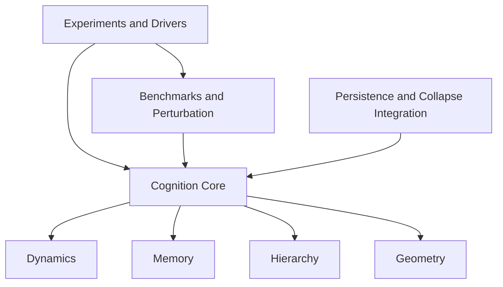

# Recursive Cognitive Manifold

Recursive Cognitive Manifold is a Python prototype for experimenting with recursive manifold dynamics, region formation, semantic and episodic memory, topology repair, perturbation testing, persistence, and collapse/attractor diagnostics.

## Setup

Install dependencies:

```bash
pip install -r requirements.txt
```

## Installation

Reference environment:

- Python 3.11+
- Linux/macOS/WSL (validated in Ubuntu CI)

Recommended local install flow:

```bash
python -m venv .venv
source .venv/bin/activate
python -m pip install --upgrade pip
pip install -r requirements.txt
```

Quick validation after installation:

```bash
PYTHONDONTWRITEBYTECODE=1 python -m unittest discover -s tests -p 'test_*.py'
PYTHONDONTWRITEBYTECODE=1 python -m rcm.experiments.benchmark_suite --seed 42
```

## Reproducibility

All primary entry points expose deterministic seed controls:

- `python demo_driver.py --seed 42 --output artifacts/demo_seed_42.png`
- `python -m rcm.experiments.lesion_recovery --seed 42 --steps 18`
- `python -m rcm.experiments.benchmark_suite --seed 42 --output artifacts/benchmarks/benchmark_report_seed_42.json`

Benchmark reports default to deterministic metadata (`seed` only). To include wall-clock generation time for ad-hoc profiling runs:

```bash
python -m rcm.experiments.benchmark_suite --seed 42 --include-timestamp
```

Performance metrics (latency and memory) may vary by hardware and runtime environment; correctness metrics should remain stable under fixed seeds.

### Release and Reference Artifacts

Every benchmark run can emit a tagged release manifest and serialized reference state snapshots:

```bash
python -m rcm.experiments.benchmark_suite --seed 42 --output artifacts/benchmarks/benchmark_report_seed_42.json
```

This writes:

- artifacts/releases/baseline_release.json
- artifacts/releases/reference_snapshots/baseline_snapshot.json
- artifacts/releases/module_map.json
- artifacts/releases/environment_report.json

The release manifest includes a tagged baseline release record, a public-vs-experimental module map, dependency and platform metadata, and a serialized reference snapshot for regression checks.

## CI-Friendly Test Commands

These commands are safe for headless CI runs and avoid polluting the repository with bytecode.

Run the unit test suite:

```bash
PYTHONDONTWRITEBYTECODE=1 python -m unittest discover -s tests -p 'test_*.py'
```

Run a syntax/import validation pass:

```bash
PYTHONDONTWRITEBYTECODE=1 python -m compileall Foundation demo_driver.py rcm rcm_benchmarks.py rcm_collapse_integration.py rcm_persistence.py rcm_perturbation_testing.py regional_hrm_field.py
```

Run a headless smoke test of the demo pipeline:

```bash
PYTHONDONTWRITEBYTECODE=1 python demo_driver.py --output /tmp/rcm_demo.png
```

Run the lesion recovery experiment with visible collapse diagnostics:

```bash
PYTHONDONTWRITEBYTECODE=1 python -m rcm.experiments.lesion_recovery
```

Run the benchmark suite with deterministic metadata:

```bash
PYTHONDONTWRITEBYTECODE=1 python -m rcm.experiments.benchmark_suite --seed 42 --output artifacts/benchmarks/ci_benchmark_report.json
```

Interpret geometry feedback metric in benchmark JSON:

- `benchmarks.geometry_feedback_gain.enabled_score`: workload score with geometry feedback active
- `benchmarks.geometry_feedback_gain.disabled_score`: same workload score with geometry feedback disabled
- `benchmarks.geometry_feedback_gain.gain_delta`: additive gain (`enabled_score - disabled_score`)
- `benchmarks.geometry_feedback_gain.gain_ratio`: relative gain (`enabled_score / disabled_score`)
- Positive delta or ratio > 1.0 indicates net benefit from geometry feedback for that benchmark run.

CI baseline regression policy:

- Every CI run compares benchmark output against the stored baseline at `benchmarks/ci_baseline_seed_42.json`.
- The comparison script (`scripts/ci/compare_benchmark_baseline.py`) prints current, baseline, and difference for tracked metrics.
- CI fails when a tracked metric exceeds its configured regression tolerance.

Stable module namespaces:

- Treat `rcm.memory`, `rcm.geometry`, and `rcm.cognition` as stable public namespaces.
- Avoid renaming or relocating these modules without explicit migration planning and compatibility updates.

## CI Pipeline

The repository includes a GitHub Actions workflow at `.github/workflows/ci.yml` that executes:

- dependency installation
- compile validation
- unit tests
- benchmark suite execution
- benchmark metadata validation
- headless demo smoke run

This aligns local validation with CI to reduce release drift.

## Architecture

### Module Layers



### Runtime Update Flow

```mermaid
flowchart LR
	I[External Input] --> J[Propagation]
	J --> K[Episodic Recall Blend]
	K --> L[Synchronization]
	L --> M[Structural Plasticity]
	M --> N[Region Update]
	N --> O[Regional HRM Fields]
	O --> P[Manifold HRM Field]
	P --> Q[Semantic Observation]
	Q --> R[Child Manifold Refresh]
	R --> S[Child Feedback Fields]
	S --> T[Snapshot and Diagnostics]
```



## Collapse Diagnostics Workflow

Collapse and attractor diagnostics are implemented in [rcm_collapse_integration.py](rcm_collapse_integration.py).

### Default Installation Paths

Collapse support is auto-installed in these entry surfaces:

- [Foundation](Foundation): extensionless compatibility loads patch `RecursiveCognitiveManifold` during import
- [rcm/experiments/specialization_demo.py](rcm/experiments/specialization_demo.py): direct package-driven demo runs install collapse support before execution

You can also install it manually in custom code:

```python
from rcm.cognition.manifold import RecursiveCognitiveManifold
from rcm_collapse_integration import install_collapse_attractor_support

install_collapse_attractor_support(RecursiveCognitiveManifold)
```

### Runtime Fields Added

After installation, manifolds expose:

- `collapse_flag`
- `collapse_energy`
- `collapse_memory`
- `attractor_anchor`
- `collapse_monitor`
- `last_collapse_metrics`

The wrapped `step()` result includes:

- `collapse`
- `region_collapse`
- `child_collapse`

The wrapped `snapshot()` includes:

- `collapse`
- `collapse_flag`
- `collapse_energy`
- `collapse_events`
- `attractor_initialized`

### Visible Diagnostics in Entry Points

The main demo path in [demo_driver.py](demo_driver.py) and [rcm/experiments/specialization_demo.py](rcm/experiments/specialization_demo.py):

- plots collapse energy in the rendered dashboard
- prints a collapse summary after execution
- includes collapse metrics in the final snapshot

The lesion recovery experiment in [rcm/experiments/lesion_recovery.py](rcm/experiments/lesion_recovery.py):

- prints a collapse summary after the post-lesion snapshot

### Test Coverage

Focused collapse tests live in [tests/test_collapse_integration.py](tests/test_collapse_integration.py) and cover:

- collapse flagging and event recording
- cooldown behavior
- attractor rebinding
- end-to-end wrapper behavior for `step()` and `snapshot()`
